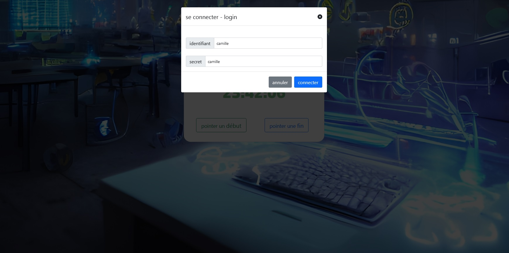
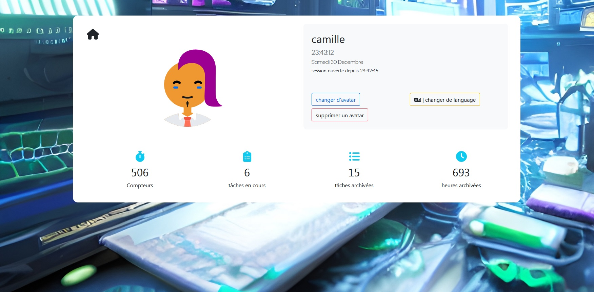
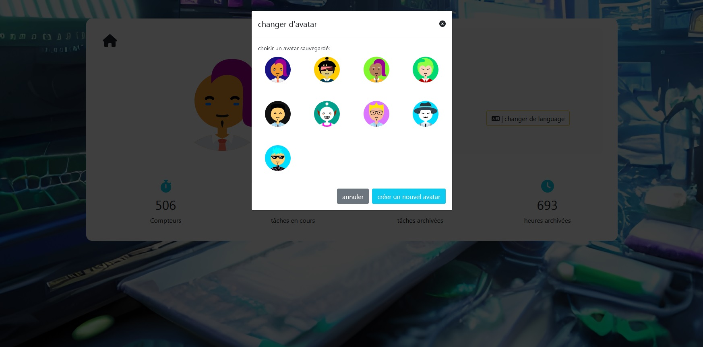
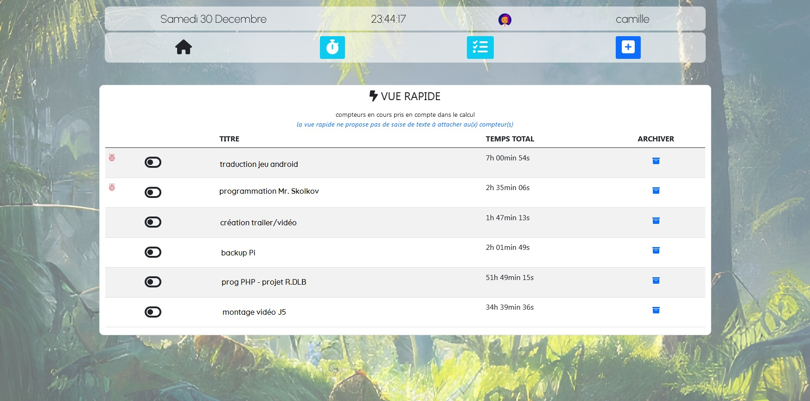

# Mr-Skolkov
For tele-workers: start time counters attached to work missions. Get how much work time spent for each mission.
ATTENTION: Please only install for Local Area Network use. Not meant for anything else than using it as a local tool, password are stored clear.

  

## Why, how, what?
Maybe as you, I am a raspberry user aka webserver and more. 
I was in need of this kind of 'application' for my tele-working, as I did not find on the internet what I wanted, I coded it.
It contains a mi french/english syntax as this is how I code for myself XD
> If ever Mr. Skolkov gets stars, I will clean the code and add langage system

  

## Install notes
- copy all the files on your server
- create a database
- import skolkov_empty.sql
- edit the config.php file (/core/config/config.php)
- browse to your directory
- add a new user

  

## Usage
You can run as many timers as you want at the same time,
you can not creat a timer if there is no task to link to.

1. create a task
2. choose a task and start a timer
3. stop a timer

  

Total time spent on each tasks is displayed.
There are 5 pages:
1. version info
2. settings - you can change/edit your avatar
3. timers - see active timers and archived ones
4. tasts - add a task - see activ tasks and archived
5. the main one - with icon menu to the 4 pages above - profile info - start/stop a timer

## config.php
- database login informations
- if adding a new user is true/false (true by default, for adding at least one user

  

## libraries or else included
- google fonts
- bootstrap 5
- font awesome 5.14
- multiavatar
- 

  

  

## NOTES

# TODO
- [x] tested on PHP 8.2
- [x] upload the files
- [ ] way to 0.2 (lang)
